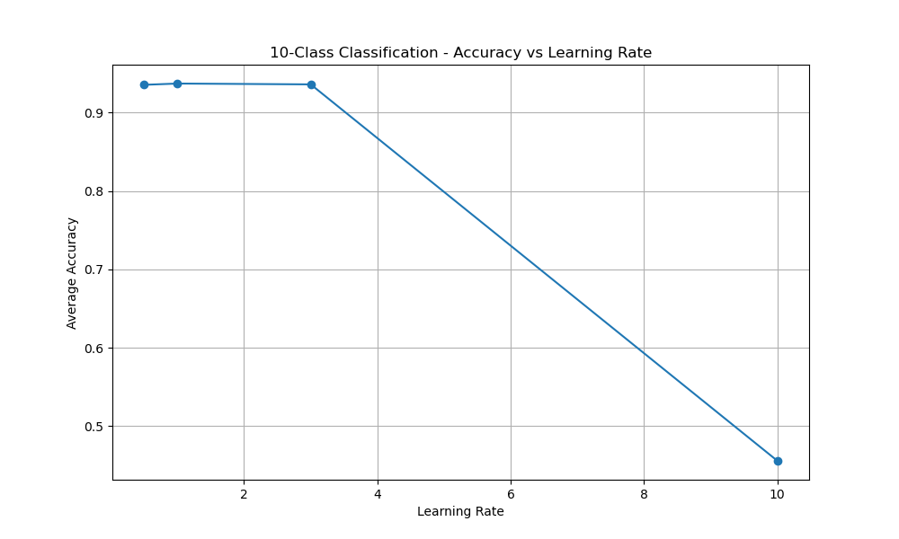
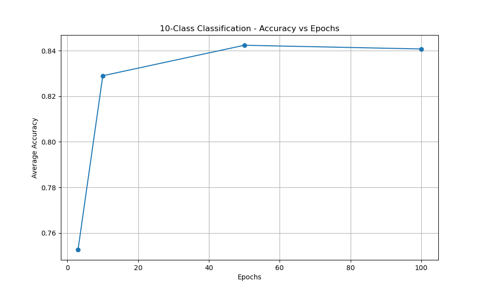
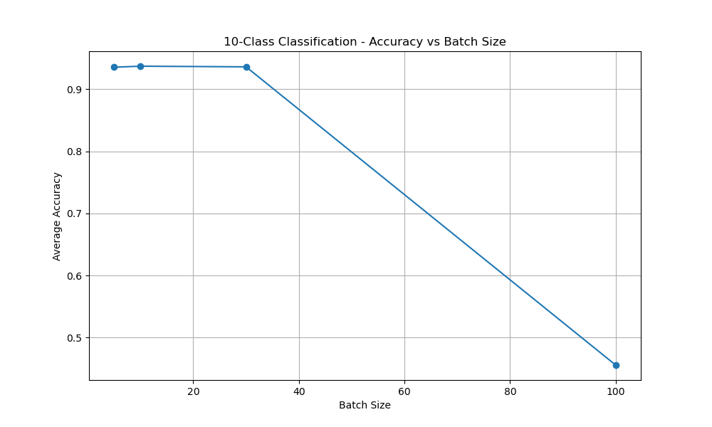
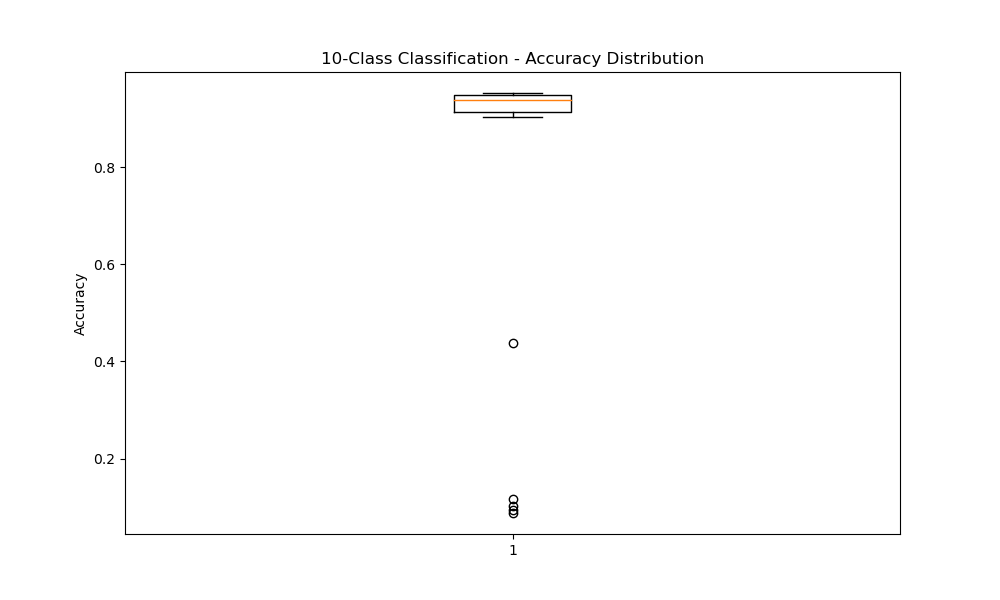

# PRÁCTICA 3: REDES NEURONALES PARA RECONOCIMIENTO DE DÍGITOS

**Estudiante:** Galicia Rioja Angel Daniel
**Fecha:** 2026-05-07 04:53:51

## RESUMEN EJECUTIVO

Este reporte presenta los resultados de experimentos automatizados con una red neuronal completamente conectada para el reconocimiento de dígitos escritos a mano. Se probaron diferentes configuraciones de parámetros para evaluar su impacto en el desempeño del sistema.

## CONFIGURACIONES PROBADAS

| Configuración | Arquitectura | Épocas | Tamaño Lote | Tasa Aprendizaje |
|---------------|--------------|--------|-------------|------------------|
| Base_0.5_lr_3_epochs_5_batch | 784-100-10 | 3 | 5 | 0.5 |
| Base_0.5_lr_10_epochs_5_batch | 784-100-10 | 10 | 5 | 0.5 |
| Base_0.5_lr_50_epochs_5_batch | 784-100-10 | 50 | 5 | 0.5 |
| Base_0.5_lr_100_epochs_5_batch | 784-100-10 | 100 | 5 | 0.5 |
| Base_1.0_lr_3_epochs_10_batch | 784-100-10 | 3 | 10 | 1.0 |
| Base_1.0_lr_10_epochs_10_batch | 784-100-10 | 10 | 10 | 1.0 |
| Base_1.0_lr_50_epochs_10_batch | 784-100-10 | 50 | 10 | 1.0 |
| Base_1.0_lr_100_epochs_10_batch | 784-100-10 | 100 | 10 | 1.0 |
| Base_3.0_lr_3_epochs_30_batch | 784-100-10 | 3 | 30 | 3.0 |
| Base_3.0_lr_10_epochs_30_batch | 784-100-10 | 10 | 30 | 3.0 |
| Base_3.0_lr_50_epochs_30_batch | 784-100-10 | 50 | 30 | 3.0 |
| Base_3.0_lr_100_epochs_30_batch | 784-100-10 | 100 | 30 | 3.0 |
| Base_10.0_lr_3_epochs_100_batch | 784-100-10 | 3 | 100 | 10.0 |
| Base_10.0_lr_10_epochs_100_batch | 784-100-10 | 10 | 100 | 10.0 |
| Base_10.0_lr_50_epochs_100_batch | 784-100-10 | 50 | 100 | 10.0 |
| Base_10.0_lr_100_epochs_100_batch | 784-100-10 | 100 | 100 | 10.0 |
| Alt_0.5_lr_3_epochs_5_batch | 784-50-25-10 | 3 | 5 | 0.5 |
| Alt_0.5_lr_10_epochs_5_batch | 784-50-25-10 | 10 | 5 | 0.5 |
| Alt_0.5_lr_50_epochs_5_batch | 784-50-25-10 | 50 | 5 | 0.5 |
| Alt_0.5_lr_100_epochs_5_batch | 784-50-25-10 | 100 | 5 | 0.5 |
| Alt_1.0_lr_3_epochs_10_batch | 784-50-25-10 | 3 | 10 | 1.0 |
| Alt_1.0_lr_10_epochs_10_batch | 784-50-25-10 | 10 | 10 | 1.0 |
| Alt_1.0_lr_50_epochs_10_batch | 784-50-25-10 | 50 | 10 | 1.0 |
| Alt_1.0_lr_100_epochs_10_batch | 784-50-25-10 | 100 | 10 | 1.0 |
| Alt_3.0_lr_3_epochs_30_batch | 784-50-25-10 | 3 | 30 | 3.0 |
| Alt_3.0_lr_10_epochs_30_batch | 784-50-25-10 | 10 | 30 | 3.0 |
| Alt_3.0_lr_50_epochs_30_batch | 784-50-25-10 | 50 | 30 | 3.0 |
| Alt_3.0_lr_100_epochs_30_batch | 784-50-25-10 | 100 | 30 | 3.0 |
| Alt_10.0_lr_3_epochs_100_batch | 784-50-25-10 | 3 | 100 | 10.0 |
| Alt_10.0_lr_10_epochs_100_batch | 784-50-25-10 | 10 | 100 | 10.0 |
| Alt_10.0_lr_50_epochs_100_batch | 784-50-25-10 | 50 | 100 | 10.0 |
| Alt_10.0_lr_100_epochs_100_batch | 784-50-25-10 | 100 | 100 | 10.0 |

## RESULTADOS DETALLADOS

### Ranking por Precisión

| Posición | Configuración | Precisión | Precisión Macro | Recall Macro | F1 Macro | Tiempo (s) |
|----------|---------------|-----------|-----------------|--------------|-----------|------------|
| 1 | Base_1.0_lr_50_epochs_10_batch | 0.953 | 0.952 | 0.951 | 0.952 | 107.2 |
| 2 | Base_3.0_lr_50_epochs_30_batch | 0.953 | 0.952 | 0.952 | 0.952 | 97.1 |
| 3 | Base_1.0_lr_100_epochs_10_batch | 0.950 | 0.949 | 0.949 | 0.949 | 214.1 |
| 4 | Alt_1.0_lr_50_epochs_10_batch | 0.950 | 0.949 | 0.949 | 0.949 | 54.2 |
| 5 | Base_0.5_lr_100_epochs_5_batch | 0.949 | 0.948 | 0.948 | 0.948 | 244.2 |
| 6 | Base_3.0_lr_100_epochs_30_batch | 0.949 | 0.948 | 0.948 | 0.948 | 194.2 |
| 7 | Alt_3.0_lr_50_epochs_30_batch | 0.949 | 0.948 | 0.948 | 0.948 | 52.9 |
| 8 | Alt_3.0_lr_100_epochs_30_batch | 0.949 | 0.948 | 0.948 | 0.948 | 105.8 |
| 9 | Alt_0.5_lr_100_epochs_5_batch | 0.948 | 0.947 | 0.947 | 0.947 | 111.3 |
| 10 | Base_0.5_lr_50_epochs_5_batch | 0.946 | 0.945 | 0.945 | 0.945 | 122.3 |
| 11 | Alt_1.0_lr_100_epochs_10_batch | 0.946 | 0.946 | 0.945 | 0.945 | 108.3 |
| 12 | Alt_10.0_lr_50_epochs_100_batch | 0.944 | 0.943 | 0.943 | 0.943 | 52.5 |
| 13 | Alt_0.5_lr_50_epochs_5_batch | 0.943 | 0.942 | 0.942 | 0.942 | 55.6 |
| 14 | Alt_10.0_lr_100_epochs_100_batch | 0.943 | 0.942 | 0.942 | 0.942 | 105.5 |
| 15 | Alt_1.0_lr_10_epochs_10_batch | 0.941 | 0.940 | 0.940 | 0.940 | 10.8 |
| 16 | Base_1.0_lr_10_epochs_10_batch | 0.939 | 0.939 | 0.938 | 0.938 | 21.5 |
| 17 | Base_3.0_lr_10_epochs_30_batch | 0.939 | 0.939 | 0.937 | 0.937 | 19.4 |
| 18 | Base_0.5_lr_10_epochs_5_batch | 0.936 | 0.937 | 0.935 | 0.935 | 24.7 |
| 19 | Alt_0.5_lr_10_epochs_5_batch | 0.936 | 0.937 | 0.934 | 0.935 | 11.1 |
| 20 | Alt_3.0_lr_10_epochs_30_batch | 0.933 | 0.933 | 0.931 | 0.932 | 10.7 |
| 21 | Alt_10.0_lr_10_epochs_100_batch | 0.919 | 0.920 | 0.918 | 0.918 | 10.5 |
| 22 | Base_1.0_lr_3_epochs_10_batch | 0.916 | 0.916 | 0.914 | 0.915 | 6.4 |
| 23 | Base_0.5_lr_3_epochs_5_batch | 0.914 | 0.913 | 0.913 | 0.913 | 7.3 |
| 24 | Base_3.0_lr_3_epochs_30_batch | 0.913 | 0.914 | 0.913 | 0.912 | 5.8 |
| 25 | Alt_0.5_lr_3_epochs_5_batch | 0.912 | 0.911 | 0.911 | 0.911 | 3.3 |
| 26 | Alt_3.0_lr_3_epochs_30_batch | 0.906 | 0.908 | 0.904 | 0.905 | 3.2 |
| 27 | Alt_1.0_lr_3_epochs_10_batch | 0.903 | 0.906 | 0.901 | 0.902 | 3.2 |
| 28 | Alt_10.0_lr_3_epochs_100_batch | 0.438 | 0.329 | 0.420 | 0.338 | 3.2 |
| 29 | Base_10.0_lr_3_epochs_100_batch | 0.117 | 0.070 | 0.125 | 0.053 | 5.5 |
| 30 | Base_10.0_lr_50_epochs_100_batch | 0.102 | 0.010 | 0.100 | 0.019 | 93.2 |
| 31 | Base_10.0_lr_100_epochs_100_batch | 0.093 | 0.009 | 0.100 | 0.017 | 186.9 |
| 32 | Base_10.0_lr_10_epochs_100_batch | 0.088 | 0.009 | 0.100 | 0.016 | 18.7 |

### Análisis por Configuración

#### Base_0.5_lr_3_epochs_5_batch

**Parámetros:**
- Arquitectura: [784, 100, 10]
- Épocas: 3
- Tamaño de lote: 5
- Tasa de aprendizaje: 0.5

**Métricas de desempeño:**
- Precisión global: 0.914
- Precisión macro: 0.913
- Recall macro: 0.913
- F1 macro: 0.913
- Tiempo de entrenamiento: 7.3s

**Precisión por clase:**
- Clase 0: Precisión=0.914, Recall=0.990, F1=0.951
- Clase 1: Precisión=0.951, Recall=0.956, F1=0.954
- Clase 2: Precisión=0.878, Recall=0.865, F1=0.871
- Clase 3: Precisión=0.878, Recall=0.858, F1=0.868
- Clase 4: Precisión=0.903, Recall=0.908, F1=0.906
- Clase 5: Precisión=0.914, Recall=0.906, F1=0.910
- Clase 6: Precisión=0.933, Recall=0.959, F1=0.946
- Clase 7: Precisión=0.953, Recall=0.914, F1=0.933
- Clase 8: Precisión=0.909, Recall=0.900, F1=0.905
- Clase 9: Precisión=0.896, Recall=0.872, F1=0.883

#### Base_0.5_lr_10_epochs_5_batch

**Parámetros:**
- Arquitectura: [784, 100, 10]
- Épocas: 10
- Tamaño de lote: 5
- Tasa de aprendizaje: 0.5

**Métricas de desempeño:**
- Precisión global: 0.936
- Precisión macro: 0.937
- Recall macro: 0.935
- F1 macro: 0.935
- Tiempo de entrenamiento: 24.7s

**Precisión por clase:**
- Clase 0: Precisión=0.971, Recall=0.995, F1=0.983
- Clase 1: Precisión=0.970, Recall=0.956, F1=0.963
- Clase 2: Precisión=0.917, Recall=0.917, F1=0.917
- Clase 3: Precisión=0.913, Recall=0.892, F1=0.902
- Clase 4: Precisión=0.964, Recall=0.876, F1=0.918
- Clase 5: Precisión=0.946, Recall=0.915, F1=0.930
- Clase 6: Precisión=0.946, Recall=0.959, F1=0.952
- Clase 7: Precisión=0.972, Recall=0.928, F1=0.949
- Clase 8: Precisión=0.900, Recall=0.950, F1=0.925
- Clase 9: Precisión=0.866, Recall=0.968, F1=0.914

#### Base_0.5_lr_50_epochs_5_batch

**Parámetros:**
- Arquitectura: [784, 100, 10]
- Épocas: 50
- Tamaño de lote: 5
- Tasa de aprendizaje: 0.5

**Métricas de desempeño:**
- Precisión global: 0.946
- Precisión macro: 0.945
- Recall macro: 0.945
- F1 macro: 0.945
- Tiempo de entrenamiento: 122.3s

**Precisión por clase:**
- Clase 0: Precisión=0.980, Recall=0.971, F1=0.975
- Clase 1: Precisión=0.970, Recall=0.961, F1=0.966
- Clase 2: Precisión=0.909, Recall=0.938, F1=0.923
- Clase 3: Precisión=0.941, Recall=0.903, F1=0.922
- Clase 4: Precisión=0.920, Recall=0.930, F1=0.925
- Clase 5: Precisión=0.952, Recall=0.939, F1=0.945
- Clase 6: Precisión=0.968, Recall=0.977, F1=0.973
- Clase 7: Precisión=0.967, Recall=0.937, F1=0.952
- Clase 8: Precisión=0.918, Recall=0.955, F1=0.936
- Clase 9: Precisión=0.926, Recall=0.941, F1=0.934

#### Base_0.5_lr_100_epochs_5_batch

**Parámetros:**
- Arquitectura: [784, 100, 10]
- Épocas: 100
- Tamaño de lote: 5
- Tasa de aprendizaje: 0.5

**Métricas de desempeño:**
- Precisión global: 0.949
- Precisión macro: 0.948
- Recall macro: 0.948
- F1 macro: 0.948
- Tiempo de entrenamiento: 244.2s

**Precisión por clase:**
- Clase 0: Precisión=0.971, Recall=0.980, F1=0.976
- Clase 1: Precisión=0.980, Recall=0.966, F1=0.973
- Clase 2: Precisión=0.938, Recall=0.953, F1=0.946
- Clase 3: Precisión=0.935, Recall=0.892, F1=0.913
- Clase 4: Precisión=0.934, Recall=0.924, F1=0.929
- Clase 5: Precisión=0.935, Recall=0.943, F1=0.939
- Clase 6: Precisión=0.977, Recall=0.963, F1=0.970
- Clase 7: Precisión=0.963, Recall=0.946, F1=0.954
- Clase 8: Precisión=0.927, Recall=0.950, F1=0.938
- Clase 9: Precisión=0.918, Recall=0.957, F1=0.937

#### Base_1.0_lr_3_epochs_10_batch

**Parámetros:**
- Arquitectura: [784, 100, 10]
- Épocas: 3
- Tamaño de lote: 10
- Tasa de aprendizaje: 1.0

**Métricas de desempeño:**
- Precisión global: 0.916
- Precisión macro: 0.916
- Recall macro: 0.914
- F1 macro: 0.915
- Tiempo de entrenamiento: 6.4s

**Precisión por clase:**
- Clase 0: Precisión=0.952, Recall=0.976, F1=0.964
- Clase 1: Precisión=0.951, Recall=0.951, F1=0.951
- Clase 2: Precisión=0.883, Recall=0.865, F1=0.874
- Clase 3: Precisión=0.954, Recall=0.824, F1=0.884
- Clase 4: Precisión=0.871, Recall=0.914, F1=0.892
- Clase 5: Precisión=0.912, Recall=0.929, F1=0.921
- Clase 6: Precisión=0.932, Recall=0.950, F1=0.941
- Clase 7: Precisión=0.949, Recall=0.919, F1=0.933
- Clase 8: Precisión=0.878, Recall=0.935, F1=0.906
- Clase 9: Precisión=0.882, Recall=0.882, F1=0.882

#### Base_1.0_lr_10_epochs_10_batch

**Parámetros:**
- Arquitectura: [784, 100, 10]
- Épocas: 10
- Tamaño de lote: 10
- Tasa de aprendizaje: 1.0

**Métricas de desempeño:**
- Precisión global: 0.939
- Precisión macro: 0.939
- Recall macro: 0.938
- F1 macro: 0.938
- Tiempo de entrenamiento: 21.5s

**Precisión por clase:**
- Clase 0: Precisión=0.971, Recall=0.990, F1=0.981
- Clase 1: Precisión=0.966, Recall=0.966, F1=0.966
- Clase 2: Precisión=0.935, Recall=0.906, F1=0.921
- Clase 3: Precisión=0.945, Recall=0.881, F1=0.912
- Clase 4: Precisión=0.943, Recall=0.892, F1=0.917
- Clase 5: Precisión=0.939, Recall=0.939, F1=0.939
- Clase 6: Precisión=0.954, Recall=0.954, F1=0.954
- Clase 7: Precisión=0.971, Recall=0.923, F1=0.947
- Clase 8: Precisión=0.894, Recall=0.965, F1=0.928
- Clase 9: Precisión=0.874, Recall=0.963, F1=0.916

#### Base_1.0_lr_50_epochs_10_batch

**Parámetros:**
- Arquitectura: [784, 100, 10]
- Épocas: 50
- Tamaño de lote: 10
- Tasa de aprendizaje: 1.0

**Métricas de desempeño:**
- Precisión global: 0.953
- Precisión macro: 0.952
- Recall macro: 0.951
- F1 macro: 0.952
- Tiempo de entrenamiento: 107.2s

**Precisión por clase:**
- Clase 0: Precisión=0.985, Recall=0.980, F1=0.983
- Clase 1: Precisión=0.975, Recall=0.966, F1=0.970
- Clase 2: Precisión=0.929, Recall=0.948, F1=0.938
- Clase 3: Precisión=0.963, Recall=0.898, F1=0.929
- Clase 4: Precisión=0.944, Recall=0.914, F1=0.929
- Clase 5: Precisión=0.940, Recall=0.953, F1=0.946
- Clase 6: Precisión=0.972, Recall=0.972, F1=0.972
- Clase 7: Precisión=0.968, Recall=0.955, F1=0.961
- Clase 8: Precisión=0.919, Recall=0.965, F1=0.941
- Clase 9: Precisión=0.928, Recall=0.963, F1=0.945

#### Base_1.0_lr_100_epochs_10_batch

**Parámetros:**
- Arquitectura: [784, 100, 10]
- Épocas: 100
- Tamaño de lote: 10
- Tasa de aprendizaje: 1.0

**Métricas de desempeño:**
- Precisión global: 0.950
- Precisión macro: 0.949
- Recall macro: 0.949
- F1 macro: 0.949
- Tiempo de entrenamiento: 214.1s

**Precisión por clase:**
- Clase 0: Precisión=0.985, Recall=0.980, F1=0.983
- Clase 1: Precisión=0.970, Recall=0.961, F1=0.966
- Clase 2: Precisión=0.938, Recall=0.943, F1=0.940
- Clase 3: Precisión=0.920, Recall=0.915, F1=0.917
- Clase 4: Precisión=0.919, Recall=0.924, F1=0.922
- Clase 5: Precisión=0.944, Recall=0.948, F1=0.946
- Clase 6: Precisión=0.977, Recall=0.963, F1=0.970
- Clase 7: Precisión=0.972, Recall=0.946, F1=0.959
- Clase 8: Precisión=0.931, Recall=0.945, F1=0.938
- Clase 9: Precisión=0.933, Recall=0.968, F1=0.950

#### Base_3.0_lr_3_epochs_30_batch

**Parámetros:**
- Arquitectura: [784, 100, 10]
- Épocas: 3
- Tamaño de lote: 30
- Tasa de aprendizaje: 3.0

**Métricas de desempeño:**
- Precisión global: 0.913
- Precisión macro: 0.914
- Recall macro: 0.913
- F1 macro: 0.912
- Tiempo de entrenamiento: 5.8s

**Precisión por clase:**
- Clase 0: Precisión=0.948, Recall=0.985, F1=0.967
- Clase 1: Precisión=0.970, Recall=0.936, F1=0.953
- Clase 2: Precisión=0.816, Recall=0.901, F1=0.856
- Clase 3: Precisión=0.932, Recall=0.858, F1=0.893
- Clase 4: Precisión=0.881, Recall=0.924, F1=0.902
- Clase 5: Precisión=0.943, Recall=0.858, F1=0.899
- Clase 6: Precisión=0.932, Recall=0.945, F1=0.938
- Clase 7: Precisión=0.971, Recall=0.896, F1=0.932
- Clase 8: Precisión=0.877, Recall=0.925, F1=0.900
- Clase 9: Precisión=0.870, Recall=0.898, F1=0.884

#### Base_3.0_lr_10_epochs_30_batch

**Parámetros:**
- Arquitectura: [784, 100, 10]
- Épocas: 10
- Tamaño de lote: 30
- Tasa de aprendizaje: 3.0

**Métricas de desempeño:**
- Precisión global: 0.939
- Precisión macro: 0.939
- Recall macro: 0.937
- F1 macro: 0.937
- Tiempo de entrenamiento: 19.4s

**Precisión por clase:**
- Clase 0: Precisión=0.976, Recall=0.980, F1=0.978
- Clase 1: Precisión=0.970, Recall=0.961, F1=0.966
- Clase 2: Precisión=0.883, Recall=0.943, F1=0.912
- Clase 3: Precisión=0.968, Recall=0.858, F1=0.910
- Clase 4: Precisión=0.887, Recall=0.930, F1=0.908
- Clase 5: Precisión=0.910, Recall=0.958, F1=0.933
- Clase 6: Precisión=0.985, Recall=0.931, F1=0.958
- Clase 7: Precisión=0.967, Recall=0.932, F1=0.949
- Clase 8: Precisión=0.919, Recall=0.965, F1=0.941
- Clase 9: Precisión=0.924, Recall=0.914, F1=0.919

#### Base_3.0_lr_50_epochs_30_batch

**Parámetros:**
- Arquitectura: [784, 100, 10]
- Épocas: 50
- Tamaño de lote: 30
- Tasa de aprendizaje: 3.0

**Métricas de desempeño:**
- Precisión global: 0.953
- Precisión macro: 0.952
- Recall macro: 0.952
- F1 macro: 0.952
- Tiempo de entrenamiento: 97.1s

**Precisión por clase:**
- Clase 0: Precisión=0.985, Recall=0.985, F1=0.985
- Clase 1: Precisión=0.975, Recall=0.966, F1=0.970
- Clase 2: Precisión=0.937, Recall=0.932, F1=0.935
- Clase 3: Precisión=0.942, Recall=0.920, F1=0.931
- Clase 4: Precisión=0.939, Recall=0.908, F1=0.923
- Clase 5: Precisión=0.957, Recall=0.948, F1=0.953
- Clase 6: Precisión=0.959, Recall=0.972, F1=0.966
- Clase 7: Precisión=0.972, Recall=0.950, F1=0.961
- Clase 8: Precisión=0.937, Recall=0.965, F1=0.951
- Clase 9: Precisión=0.914, Recall=0.968, F1=0.940

#### Base_3.0_lr_100_epochs_30_batch

**Parámetros:**
- Arquitectura: [784, 100, 10]
- Épocas: 100
- Tamaño de lote: 30
- Tasa de aprendizaje: 3.0

**Métricas de desempeño:**
- Precisión global: 0.949
- Precisión macro: 0.948
- Recall macro: 0.948
- F1 macro: 0.948
- Tiempo de entrenamiento: 194.2s

**Precisión por clase:**
- Clase 0: Precisión=0.980, Recall=0.980, F1=0.980
- Clase 1: Precisión=0.975, Recall=0.961, F1=0.968
- Clase 2: Precisión=0.927, Recall=0.932, F1=0.930
- Clase 3: Precisión=0.936, Recall=0.915, F1=0.925
- Clase 4: Precisión=0.940, Recall=0.930, F1=0.935
- Clase 5: Precisión=0.957, Recall=0.943, F1=0.950
- Clase 6: Precisión=0.955, Recall=0.968, F1=0.961
- Clase 7: Precisión=0.968, Recall=0.946, F1=0.957
- Clase 8: Precisión=0.918, Recall=0.950, F1=0.934
- Clase 9: Precisión=0.922, Recall=0.952, F1=0.937

#### Base_10.0_lr_3_epochs_100_batch

**Parámetros:**
- Arquitectura: [784, 100, 10]
- Épocas: 3
- Tamaño de lote: 100
- Tasa de aprendizaje: 10.0

**Métricas de desempeño:**
- Precisión global: 0.117
- Precisión macro: 0.070
- Recall macro: 0.125
- F1 macro: 0.053
- Tiempo de entrenamiento: 5.5s

**Precisión por clase:**
- Clase 0: Precisión=0.000, Recall=0.000, F1=0.000
- Clase 1: Precisión=0.000, Recall=0.000, F1=0.000
- Clase 2: Precisión=0.000, Recall=0.000, F1=0.000
- Clase 3: Precisión=0.000, Recall=0.000, F1=0.000
- Clase 4: Precisión=0.097, Recall=1.000, F1=0.176
- Clase 5: Precisión=0.000, Recall=0.000, F1=0.000
- Clase 6: Precisión=0.000, Recall=0.000, F1=0.000
- Clase 7: Precisión=0.000, Recall=0.000, F1=0.000
- Clase 8: Precisión=0.602, Recall=0.250, F1=0.353
- Clase 9: Precisión=0.000, Recall=0.000, F1=0.000

#### Base_10.0_lr_10_epochs_100_batch

**Parámetros:**
- Arquitectura: [784, 100, 10]
- Épocas: 10
- Tamaño de lote: 100
- Tasa de aprendizaje: 10.0

**Métricas de desempeño:**
- Precisión global: 0.088
- Precisión macro: 0.009
- Recall macro: 0.100
- F1 macro: 0.016
- Tiempo de entrenamiento: 18.7s

**Precisión por clase:**
- Clase 0: Precisión=0.000, Recall=0.000, F1=0.000
- Clase 1: Precisión=0.000, Recall=0.000, F1=0.000
- Clase 2: Precisión=0.000, Recall=0.000, F1=0.000
- Clase 3: Precisión=0.088, Recall=1.000, F1=0.162
- Clase 4: Precisión=0.000, Recall=0.000, F1=0.000
- Clase 5: Precisión=0.000, Recall=0.000, F1=0.000
- Clase 6: Precisión=0.000, Recall=0.000, F1=0.000
- Clase 7: Precisión=0.000, Recall=0.000, F1=0.000
- Clase 8: Precisión=0.000, Recall=0.000, F1=0.000
- Clase 9: Precisión=0.000, Recall=0.000, F1=0.000

#### Base_10.0_lr_50_epochs_100_batch

**Parámetros:**
- Arquitectura: [784, 100, 10]
- Épocas: 50
- Tamaño de lote: 100
- Tasa de aprendizaje: 10.0

**Métricas de desempeño:**
- Precisión global: 0.102
- Precisión macro: 0.010
- Recall macro: 0.100
- F1 macro: 0.019
- Tiempo de entrenamiento: 93.2s

**Precisión por clase:**
- Clase 0: Precisión=0.102, Recall=1.000, F1=0.186
- Clase 1: Precisión=0.000, Recall=0.000, F1=0.000
- Clase 2: Precisión=0.000, Recall=0.000, F1=0.000
- Clase 3: Precisión=0.000, Recall=0.000, F1=0.000
- Clase 4: Precisión=0.000, Recall=0.000, F1=0.000
- Clase 5: Precisión=0.000, Recall=0.000, F1=0.000
- Clase 6: Precisión=0.000, Recall=0.000, F1=0.000
- Clase 7: Precisión=0.000, Recall=0.000, F1=0.000
- Clase 8: Precisión=0.000, Recall=0.000, F1=0.000
- Clase 9: Precisión=0.000, Recall=0.000, F1=0.000

#### Base_10.0_lr_100_epochs_100_batch

**Parámetros:**
- Arquitectura: [784, 100, 10]
- Épocas: 100
- Tamaño de lote: 100
- Tasa de aprendizaje: 10.0

**Métricas de desempeño:**
- Precisión global: 0.093
- Precisión macro: 0.009
- Recall macro: 0.100
- F1 macro: 0.017
- Tiempo de entrenamiento: 186.9s

**Precisión por clase:**
- Clase 0: Precisión=0.000, Recall=0.000, F1=0.000
- Clase 1: Precisión=0.000, Recall=0.000, F1=0.000
- Clase 2: Precisión=0.000, Recall=0.000, F1=0.000
- Clase 3: Precisión=0.000, Recall=0.000, F1=0.000
- Clase 4: Precisión=0.000, Recall=0.000, F1=0.000
- Clase 5: Precisión=0.000, Recall=0.000, F1=0.000
- Clase 6: Precisión=0.000, Recall=0.000, F1=0.000
- Clase 7: Precisión=0.000, Recall=0.000, F1=0.000
- Clase 8: Precisión=0.000, Recall=0.000, F1=0.000
- Clase 9: Precisión=0.093, Recall=1.000, F1=0.171

#### Alt_0.5_lr_3_epochs_5_batch

**Parámetros:**
- Arquitectura: [784, 50, 25, 10]
- Épocas: 3
- Tamaño de lote: 5
- Tasa de aprendizaje: 0.5

**Métricas de desempeño:**
- Precisión global: 0.912
- Precisión macro: 0.911
- Recall macro: 0.911
- F1 macro: 0.911
- Tiempo de entrenamiento: 3.3s

**Precisión por clase:**
- Clase 0: Precisión=0.918, Recall=0.980, F1=0.948
- Clase 1: Precisión=0.965, Recall=0.941, F1=0.953
- Clase 2: Precisión=0.912, Recall=0.859, F1=0.885
- Clase 3: Precisión=0.843, Recall=0.886, F1=0.864
- Clase 4: Precisión=0.904, Recall=0.914, F1=0.909
- Clase 5: Precisión=0.915, Recall=0.868, F1=0.891
- Clase 6: Precisión=0.928, Recall=0.950, F1=0.939
- Clase 7: Precisión=0.936, Recall=0.923, F1=0.929
- Clase 8: Precisión=0.907, Recall=0.880, F1=0.893
- Clase 9: Precisión=0.881, Recall=0.909, F1=0.895

#### Alt_0.5_lr_10_epochs_5_batch

**Parámetros:**
- Arquitectura: [784, 50, 25, 10]
- Épocas: 10
- Tamaño de lote: 5
- Tasa de aprendizaje: 0.5

**Métricas de desempeño:**
- Precisión global: 0.936
- Precisión macro: 0.937
- Recall macro: 0.934
- F1 macro: 0.935
- Tiempo de entrenamiento: 11.1s

**Precisión por clase:**
- Clase 0: Precisión=0.957, Recall=0.980, F1=0.969
- Clase 1: Precisión=0.943, Recall=0.966, F1=0.954
- Clase 2: Precisión=0.954, Recall=0.865, F1=0.907
- Clase 3: Precisión=0.933, Recall=0.864, F1=0.897
- Clase 4: Precisión=0.949, Recall=0.897, F1=0.922
- Clase 5: Precisión=0.909, Recall=0.943, F1=0.926
- Clase 6: Precisión=0.967, Recall=0.954, F1=0.961
- Clase 7: Precisión=0.915, Recall=0.968, F1=0.941
- Clase 8: Precisión=0.941, Recall=0.950, F1=0.945
- Clase 9: Precisión=0.904, Recall=0.957, F1=0.930

#### Alt_0.5_lr_50_epochs_5_batch

**Parámetros:**
- Arquitectura: [784, 50, 25, 10]
- Épocas: 50
- Tamaño de lote: 5
- Tasa de aprendizaje: 0.5

**Métricas de desempeño:**
- Precisión global: 0.943
- Precisión macro: 0.942
- Recall macro: 0.942
- F1 macro: 0.942
- Tiempo de entrenamiento: 55.6s

**Precisión por clase:**
- Clase 0: Precisión=0.980, Recall=0.976, F1=0.978
- Clase 1: Precisión=0.957, Recall=0.975, F1=0.966
- Clase 2: Precisión=0.907, Recall=0.911, F1=0.909
- Clase 3: Precisión=0.918, Recall=0.892, F1=0.905
- Clase 4: Precisión=0.945, Recall=0.924, F1=0.934
- Clase 5: Precisión=0.943, Recall=0.939, F1=0.941
- Clase 6: Precisión=0.959, Recall=0.968, F1=0.963
- Clase 7: Precisión=0.967, Recall=0.937, F1=0.952
- Clase 8: Precisión=0.926, Recall=0.935, F1=0.930
- Clase 9: Precisión=0.918, Recall=0.963, F1=0.940

#### Alt_0.5_lr_100_epochs_5_batch

**Parámetros:**
- Arquitectura: [784, 50, 25, 10]
- Épocas: 100
- Tamaño de lote: 5
- Tasa de aprendizaje: 0.5

**Métricas de desempeño:**
- Precisión global: 0.948
- Precisión macro: 0.947
- Recall macro: 0.947
- F1 macro: 0.947
- Tiempo de entrenamiento: 111.3s

**Precisión por clase:**
- Clase 0: Precisión=0.971, Recall=0.971, F1=0.971
- Clase 1: Precisión=0.971, Recall=0.975, F1=0.973
- Clase 2: Precisión=0.909, Recall=0.932, F1=0.920
- Clase 3: Precisión=0.941, Recall=0.909, F1=0.925
- Clase 4: Precisión=0.940, Recall=0.924, F1=0.932
- Clase 5: Precisión=0.971, Recall=0.934, F1=0.952
- Clase 6: Precisión=0.960, Recall=0.982, F1=0.971
- Clase 7: Precisión=0.972, Recall=0.941, F1=0.956
- Clase 8: Precisión=0.931, Recall=0.945, F1=0.938
- Clase 9: Precisión=0.909, Recall=0.957, F1=0.932

#### Alt_1.0_lr_3_epochs_10_batch

**Parámetros:**
- Arquitectura: [784, 50, 25, 10]
- Épocas: 3
- Tamaño de lote: 10
- Tasa de aprendizaje: 1.0

**Métricas de desempeño:**
- Precisión global: 0.903
- Precisión macro: 0.906
- Recall macro: 0.901
- F1 macro: 0.902
- Tiempo de entrenamiento: 3.2s

**Precisión por clase:**
- Clase 0: Precisión=0.913, Recall=0.976, F1=0.943
- Clase 1: Precisión=0.974, Recall=0.931, F1=0.952
- Clase 2: Precisión=0.849, Recall=0.880, F1=0.864
- Clase 3: Precisión=0.952, Recall=0.784, F1=0.860
- Clase 4: Precisión=0.942, Recall=0.876, F1=0.908
- Clase 5: Precisión=0.906, Recall=0.863, F1=0.884
- Clase 6: Precisión=0.910, Recall=0.931, F1=0.921
- Clase 7: Precisión=0.939, Recall=0.905, F1=0.922
- Clase 8: Precisión=0.877, Recall=0.930, F1=0.903
- Clase 9: Precisión=0.795, Recall=0.936, F1=0.860

#### Alt_1.0_lr_10_epochs_10_batch

**Parámetros:**
- Arquitectura: [784, 50, 25, 10]
- Épocas: 10
- Tamaño de lote: 10
- Tasa de aprendizaje: 1.0

**Métricas de desempeño:**
- Precisión global: 0.941
- Precisión macro: 0.940
- Recall macro: 0.940
- F1 macro: 0.940
- Tiempo de entrenamiento: 10.8s

**Precisión por clase:**
- Clase 0: Precisión=0.971, Recall=0.980, F1=0.976
- Clase 1: Precisión=0.970, Recall=0.951, F1=0.960
- Clase 2: Precisión=0.904, Recall=0.927, F1=0.915
- Clase 3: Precisión=0.935, Recall=0.898, F1=0.916
- Clase 4: Precisión=0.896, Recall=0.930, F1=0.912
- Clase 5: Precisión=0.917, Recall=0.943, F1=0.930
- Clase 6: Precisión=0.981, Recall=0.945, F1=0.963
- Clase 7: Precisión=0.947, Recall=0.964, F1=0.955
- Clase 8: Precisión=0.959, Recall=0.940, F1=0.949
- Clase 9: Precisión=0.925, Recall=0.920, F1=0.922

#### Alt_1.0_lr_50_epochs_10_batch

**Parámetros:**
- Arquitectura: [784, 50, 25, 10]
- Épocas: 50
- Tamaño de lote: 10
- Tasa de aprendizaje: 1.0

**Métricas de desempeño:**
- Precisión global: 0.950
- Precisión macro: 0.949
- Recall macro: 0.949
- F1 macro: 0.949
- Tiempo de entrenamiento: 54.2s

**Precisión por clase:**
- Clase 0: Precisión=0.976, Recall=0.976, F1=0.976
- Clase 1: Precisión=0.975, Recall=0.966, F1=0.970
- Clase 2: Precisión=0.933, Recall=0.943, F1=0.938
- Clase 3: Precisión=0.953, Recall=0.920, F1=0.936
- Clase 4: Precisión=0.923, Recall=0.914, F1=0.918
- Clase 5: Precisión=0.962, Recall=0.943, F1=0.952
- Clase 6: Precisión=0.950, Recall=0.968, F1=0.959
- Clase 7: Precisión=0.973, Recall=0.964, F1=0.968
- Clase 8: Precisión=0.922, Recall=0.950, F1=0.936
- Clase 9: Precisión=0.927, Recall=0.947, F1=0.937

#### Alt_1.0_lr_100_epochs_10_batch

**Parámetros:**
- Arquitectura: [784, 50, 25, 10]
- Épocas: 100
- Tamaño de lote: 10
- Tasa de aprendizaje: 1.0

**Métricas de desempeño:**
- Precisión global: 0.946
- Precisión macro: 0.946
- Recall macro: 0.945
- F1 macro: 0.945
- Tiempo de entrenamiento: 108.3s

**Precisión por clase:**
- Clase 0: Precisión=0.953, Recall=0.980, F1=0.966
- Clase 1: Precisión=0.980, Recall=0.961, F1=0.970
- Clase 2: Precisión=0.942, Recall=0.927, F1=0.934
- Clase 3: Precisión=0.942, Recall=0.920, F1=0.931
- Clase 4: Precisión=0.945, Recall=0.924, F1=0.934
- Clase 5: Precisión=0.939, Recall=0.948, F1=0.944
- Clase 6: Precisión=0.958, Recall=0.950, F1=0.954
- Clase 7: Precisión=0.967, Recall=0.937, F1=0.952
- Clase 8: Precisión=0.922, Recall=0.950, F1=0.936
- Clase 9: Precisión=0.909, Recall=0.957, F1=0.932

#### Alt_3.0_lr_3_epochs_30_batch

**Parámetros:**
- Arquitectura: [784, 50, 25, 10]
- Épocas: 3
- Tamaño de lote: 30
- Tasa de aprendizaje: 3.0

**Métricas de desempeño:**
- Precisión global: 0.906
- Precisión macro: 0.908
- Recall macro: 0.904
- F1 macro: 0.905
- Tiempo de entrenamiento: 3.2s

**Precisión por clase:**
- Clase 0: Precisión=0.906, Recall=0.990, F1=0.946
- Clase 1: Precisión=0.951, Recall=0.946, F1=0.948
- Clase 2: Precisión=0.873, Recall=0.859, F1=0.866
- Clase 3: Precisión=0.912, Recall=0.830, F1=0.869
- Clase 4: Precisión=0.914, Recall=0.914, F1=0.914
- Clase 5: Precisión=0.897, Recall=0.858, F1=0.877
- Clase 6: Precisión=0.881, Recall=0.950, F1=0.914
- Clase 7: Precisión=0.889, Recall=0.946, F1=0.917
- Clase 8: Precisión=0.914, Recall=0.900, F1=0.907
- Clase 9: Precisión=0.941, Recall=0.850, F1=0.893

#### Alt_3.0_lr_10_epochs_30_batch

**Parámetros:**
- Arquitectura: [784, 50, 25, 10]
- Épocas: 10
- Tamaño de lote: 30
- Tasa de aprendizaje: 3.0

**Métricas de desempeño:**
- Precisión global: 0.933
- Precisión macro: 0.933
- Recall macro: 0.931
- F1 macro: 0.932
- Tiempo de entrenamiento: 10.7s

**Precisión por clase:**
- Clase 0: Precisión=0.971, Recall=0.976, F1=0.973
- Clase 1: Precisión=0.947, Recall=0.961, F1=0.954
- Clase 2: Precisión=0.921, Recall=0.906, F1=0.913
- Clase 3: Precisión=0.943, Recall=0.852, F1=0.896
- Clase 4: Precisión=0.948, Recall=0.892, F1=0.919
- Clase 5: Precisión=0.917, Recall=0.939, F1=0.928
- Clase 6: Precisión=0.929, Recall=0.954, F1=0.941
- Clase 7: Precisión=0.954, Recall=0.937, F1=0.945
- Clase 8: Precisión=0.900, Recall=0.945, F1=0.922
- Clase 9: Precisión=0.904, Recall=0.952, F1=0.927

#### Alt_3.0_lr_50_epochs_30_batch

**Parámetros:**
- Arquitectura: [784, 50, 25, 10]
- Épocas: 50
- Tamaño de lote: 30
- Tasa de aprendizaje: 3.0

**Métricas de desempeño:**
- Precisión global: 0.949
- Precisión macro: 0.948
- Recall macro: 0.948
- F1 macro: 0.948
- Tiempo de entrenamiento: 52.9s

**Precisión por clase:**
- Clase 0: Precisión=0.985, Recall=0.971, F1=0.978
- Clase 1: Precisión=0.970, Recall=0.956, F1=0.963
- Clase 2: Precisión=0.927, Recall=0.932, F1=0.930
- Clase 3: Precisión=0.936, Recall=0.915, F1=0.925
- Clase 4: Precisión=0.936, Recall=0.946, F1=0.941
- Clase 5: Precisión=0.940, Recall=0.953, F1=0.946
- Clase 6: Precisión=0.986, Recall=0.972, F1=0.979
- Clase 7: Precisión=0.986, Recall=0.928, F1=0.956
- Clase 8: Precisión=0.918, Recall=0.950, F1=0.934
- Clase 9: Precisión=0.895, Recall=0.957, F1=0.925

#### Alt_3.0_lr_100_epochs_30_batch

**Parámetros:**
- Arquitectura: [784, 50, 25, 10]
- Épocas: 100
- Tamaño de lote: 30
- Tasa de aprendizaje: 3.0

**Métricas de desempeño:**
- Precisión global: 0.949
- Precisión macro: 0.948
- Recall macro: 0.948
- F1 macro: 0.948
- Tiempo de entrenamiento: 105.8s

**Precisión por clase:**
- Clase 0: Precisión=0.966, Recall=0.966, F1=0.966
- Clase 1: Precisión=0.966, Recall=0.961, F1=0.963
- Clase 2: Precisión=0.934, Recall=0.953, F1=0.943
- Clase 3: Precisión=0.936, Recall=0.909, F1=0.922
- Clase 4: Precisión=0.955, Recall=0.919, F1=0.937
- Clase 5: Precisión=0.943, Recall=0.939, F1=0.941
- Clase 6: Precisión=0.977, Recall=0.968, F1=0.972
- Clase 7: Precisión=0.968, Recall=0.964, F1=0.966
- Clase 8: Precisión=0.926, Recall=0.940, F1=0.933
- Clase 9: Precisión=0.909, Recall=0.957, F1=0.932

#### Alt_10.0_lr_3_epochs_100_batch

**Parámetros:**
- Arquitectura: [784, 50, 25, 10]
- Épocas: 3
- Tamaño de lote: 100
- Tasa de aprendizaje: 10.0

**Métricas de desempeño:**
- Precisión global: 0.438
- Precisión macro: 0.329
- Recall macro: 0.420
- F1 macro: 0.338
- Tiempo de entrenamiento: 3.2s

**Precisión por clase:**
- Clase 0: Precisión=0.000, Recall=0.000, F1=0.000
- Clase 1: Precisión=0.878, Recall=0.951, F1=0.913
- Clase 2: Precisión=0.990, Recall=0.531, F1=0.692
- Clase 3: Precisión=0.000, Recall=0.000, F1=0.000
- Clase 4: Precisión=0.000, Recall=0.000, F1=0.000
- Clase 5: Precisión=0.000, Recall=0.000, F1=0.000
- Clase 6: Precisión=0.185, Recall=0.881, F1=0.306
- Clase 7: Precisión=0.725, Recall=0.955, F1=0.824
- Clase 8: Precisión=0.509, Recall=0.885, F1=0.646
- Clase 9: Precisión=0.000, Recall=0.000, F1=0.000

#### Alt_10.0_lr_10_epochs_100_batch

**Parámetros:**
- Arquitectura: [784, 50, 25, 10]
- Épocas: 10
- Tamaño de lote: 100
- Tasa de aprendizaje: 10.0

**Métricas de desempeño:**
- Precisión global: 0.919
- Precisión macro: 0.920
- Recall macro: 0.918
- F1 macro: 0.918
- Tiempo de entrenamiento: 10.5s

**Precisión por clase:**
- Clase 0: Precisión=0.985, Recall=0.976, F1=0.980
- Clase 1: Precisión=0.970, Recall=0.941, F1=0.955
- Clase 2: Precisión=0.850, Recall=0.911, F1=0.879
- Clase 3: Precisión=0.932, Recall=0.858, F1=0.893
- Clase 4: Precisión=0.825, Recall=0.941, F1=0.879
- Clase 5: Precisión=0.909, Recall=0.939, F1=0.923
- Clase 6: Precisión=0.944, Recall=0.931, F1=0.938
- Clase 7: Precisión=0.971, Recall=0.910, F1=0.939
- Clase 8: Precisión=0.896, Recall=0.945, F1=0.920
- Clase 9: Precisión=0.923, Recall=0.829, F1=0.873

#### Alt_10.0_lr_50_epochs_100_batch

**Parámetros:**
- Arquitectura: [784, 50, 25, 10]
- Épocas: 50
- Tamaño de lote: 100
- Tasa de aprendizaje: 10.0

**Métricas de desempeño:**
- Precisión global: 0.944
- Precisión macro: 0.943
- Recall macro: 0.943
- F1 macro: 0.943
- Tiempo de entrenamiento: 52.5s

**Precisión por clase:**
- Clase 0: Precisión=0.985, Recall=0.971, F1=0.978
- Clase 1: Precisión=0.965, Recall=0.956, F1=0.961
- Clase 2: Precisión=0.927, Recall=0.922, F1=0.924
- Clase 3: Precisión=0.918, Recall=0.892, F1=0.905
- Clase 4: Precisión=0.930, Recall=0.930, F1=0.930
- Clase 5: Precisión=0.935, Recall=0.943, F1=0.939
- Clase 6: Precisión=0.963, Recall=0.968, F1=0.966
- Clase 7: Precisión=0.968, Recall=0.959, F1=0.964
- Clase 8: Precisión=0.925, Recall=0.930, F1=0.928
- Clase 9: Precisión=0.913, Recall=0.957, F1=0.935

#### Alt_10.0_lr_100_epochs_100_batch

**Parámetros:**
- Arquitectura: [784, 50, 25, 10]
- Épocas: 100
- Tamaño de lote: 100
- Tasa de aprendizaje: 10.0

**Métricas de desempeño:**
- Precisión global: 0.943
- Precisión macro: 0.942
- Recall macro: 0.942
- F1 macro: 0.942
- Tiempo de entrenamiento: 105.5s

**Precisión por clase:**
- Clase 0: Precisión=0.980, Recall=0.976, F1=0.978
- Clase 1: Precisión=0.966, Recall=0.961, F1=0.963
- Clase 2: Precisión=0.911, Recall=0.906, F1=0.909
- Clase 3: Precisión=0.920, Recall=0.909, F1=0.914
- Clase 4: Precisión=0.944, Recall=0.908, F1=0.926
- Clase 5: Precisión=0.952, Recall=0.939, F1=0.945
- Clase 6: Precisión=0.964, Recall=0.977, F1=0.970
- Clase 7: Precisión=0.967, Recall=0.932, F1=0.949
- Clase 8: Precisión=0.928, Recall=0.960, F1=0.943
- Clase 9: Precisión=0.890, Recall=0.952, F1=0.920

## GRÁFICOS DE ANÁLISIS

### Precisión vs Tasa de Aprendizaje

### Precisión vs Número de Épocas

### Precisión vs Tamaño del Lote

### Distribución de Precisión

## CONCLUSIONES

### Mejor Configuración

La configuración con mejor desempeño fue **Base_1.0_lr_50_epochs_10_batch** con una precisión de 0.953. Esta configuración utilizó una arquitectura [784, 100, 10] con 50 épocas, tamaño de lote 10 y tasa de aprendizaje 1.0.

### Análisis de Parámetros

**Impacto de la tasa de aprendizaje:**
- Tasa 0.5: Precisión promedio = 0.936
- Tasa 1.0: Precisión promedio = 0.937
- Tasa 3.0: Precisión promedio = 0.936
- Tasa 10.0: Precisión promedio = 0.456

**Impacto del tamaño del lote:**
- Tamaño 5: Precisión promedio = 0.936
- Tamaño 10: Precisión promedio = 0.937
- Tamaño 30: Precisión promedio = 0.936
- Tamaño 100: Precisión promedio = 0.456

**Impacto del número de épocas:**
- Épocas 3: Precisión promedio = 0.753
- Épocas 10: Precisión promedio = 0.829
- Épocas 50: Precisión promedio = 0.842
- Épocas 100: Precisión promedio = 0.841

---

*Reporte generado automáticamente por el sistema de experimentación*
