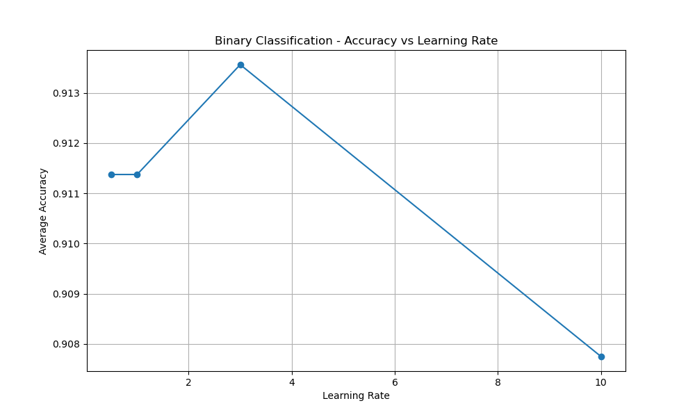
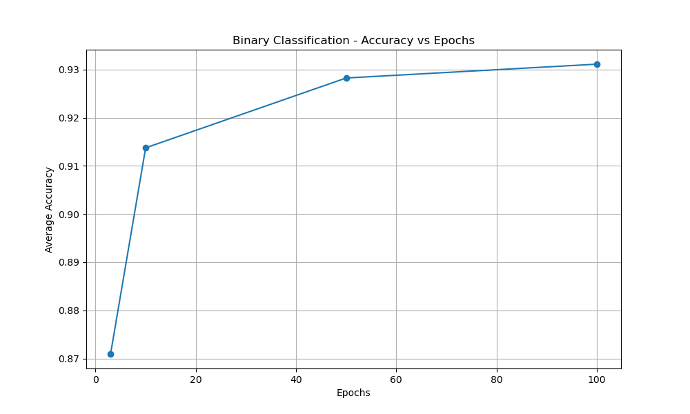
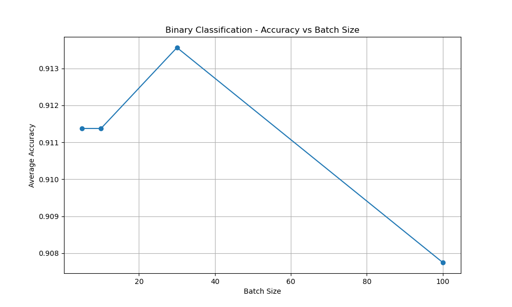
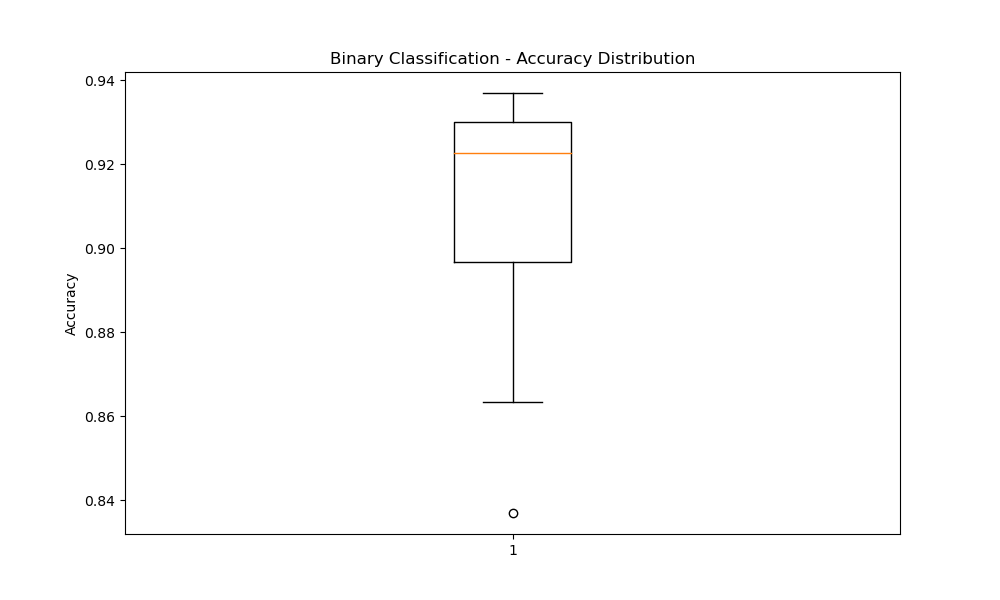

# PRÁCTICA 3: ANÁLISIS COMPARATIVO

**Estudiante:** Galicia Rioja Angel Daniel
**Fecha:** 2026-05-07 05:26:08

## RESUMEN EJECUTIVO

Este reporte compara los resultados de dos enfoques para el reconocimiento de dígitos escritos a mano:

1. **Enfoque Tradicional**: 10 clases separadas (784-100-10)
2. **Enfoque Binario**: Representación de 4 bits (784-100-4)

## COMPARACIÓN GENERAL

| Enfoque | Mejor Precisión | Tiempo Promedio | Arquitectura |
|---------|----------------|-----------------|--------------|
| Tradicional | 0.953 | 107.2s | [784, 100, 10] |
| Binario | 0.937 | 236.6s | [784, 100, 4] |

## ANÁLISIS POR PARÁMETROS

### Impacto de la Tasa de Aprendizaje

| Tasa Aprendizaje | Tradicional | Binario | Diferencia |
|------------------|-------------|---------|------------|
| 0.5 | 0.936 | 0.911 | +0.024 |
| 1.0 | 0.937 | 0.911 | +0.026 |
| 3.0 | 0.936 | 0.914 | +0.023 |
| 10.0 | 0.456 | 0.908 | -0.452 |

### Impacto del Número de Épocas

| Épocas | Tradicional | Binario | Diferencia |
|--------|-------------|---------|------------|
| 3 | 0.753 | 0.871 | -0.118 |
| 10 | 0.829 | 0.914 | -0.085 |
| 50 | 0.842 | 0.928 | -0.086 |
| 100 | 0.841 | 0.931 | -0.090 |

### Impacto del Tamaño del Lote

| Tamaño Lote | Tradicional | Binario | Diferencia |
|-------------|-------------|---------|------------|
| 5 | 0.936 | 0.911 | +0.024 |
| 10 | 0.937 | 0.911 | +0.026 |
| 30 | 0.936 | 0.914 | +0.023 |
| 100 | 0.456 | 0.908 | -0.452 |

## GRÁFICOS DE ANÁLISIS

### Clasificación de 10 Clases

### Clasificación Binaria

## CONCLUSIONES

**Precisión promedio - Tradicional:** 0.816
**Precisión promedio - Binario:** 0.911

El enfoque binario muestra un mejor desempeño general con una diferencia de 0.095 en precisión.

### Recomendaciones

- **Para máxima precisión**: Utilizar el enfoque tradicional con 10 clases separadas
- **Para eficiencia**: Considerar el enfoque binario cuando se requiera menor complejidad
- **Optimización**: Los parámetros óptimos varían según el enfoque utilizado

---

*Reporte comparativo generado automáticamente*
